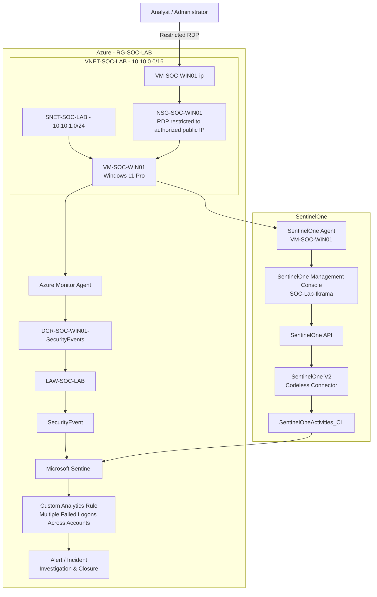

# SOC Cloud Security Lab

A hands-on Security Operations Center (SOC) and cloud-security learning lab built on Microsoft Azure.

The lab is designed as a progressive environment rather than a one-time deployment. Each phase introduces a security capability, validates it with controlled activity, and documents the result.

## Objectives

- Build practical SOC fundamentals using Microsoft Sentinel.
- Learn Windows security telemetry and event investigation.
- Understand Azure Monitor Agent (AMA), Data Collection Rules (DCRs), Log Analytics, KQL, detections, incidents, and response workflows.
- Integrate endpoint security telemetry from SentinelOne into Microsoft Sentinel.
- Progress from endpoint monitoring into multi-source SOC investigation and correlation.
- Practice security architecture, network segmentation, identity, logging, detection engineering, investigation, threat hunting, and incident response.
- Maintain the project as a documented portfolio project with reproducible configuration and lessons learned.
- Keep Azure usage cost-conscious because the lab is running on an Azure for Students subscription.

## Current Lab Status

### Milestone 01 - Azure SOC Foundation & Windows Telemetry Pipeline: Complete

The lab can:

1. Generate Windows Security events on `VM-SOC-WIN01`.
2. Collect Windows Security events using Azure Monitor Agent.
3. Apply a Data Collection Rule using the Common event set.
4. Ingest events into the `SecurityEvent` table in `LAW-SOC-LAB`.
5. Query the telemetry using KQL in Microsoft Sentinel.

### Milestone 02 - Detection Engineering & Incident Investigation: Complete

The lab can now:

1. Identify failed network logons using Windows Event ID `4625`.
2. Aggregate failed logons by source IP and five-minute window.
3. Detect multiple failed authentication attempts targeting multiple accounts.
4. Generate a Sentinel alert from a custom analytics rule.
5. Create and investigate a Sentinel incident.
6. Distinguish controlled lab activity from a potentially real-world event using investigation context.
7. Close the incident after completing the investigation.

### Milestone 03 - SentinelOne EDR Integration: Complete

A SentinelOne EDR layer has been added to the Windows endpoint:

1. `VM-SOC-WIN01` is protected by the SentinelOne agent.
2. The endpoint is assigned to the dedicated `SOC-Lab-Ikrama` SentinelOne group.
3. The SentinelOne endpoint is healthy and connected to the management console.
4. The **SentinelOne V2 (via Codeless Connector Framework)** solution is installed in Microsoft Sentinel.
5. The SentinelOne API connection is configured.
6. SentinelOne activity telemetry is being ingested into `SentinelOneActivities_CL`.
7. The schema of the SentinelOne activity table has been inspected.
8. SentinelOne activity records have been queried successfully from Microsoft Sentinel.

> At this stage, the SentinelOne integration is validated for telemetry ingestion. S1-specific detections, threat simulations, and cross-source correlation are intentionally reserved for later phases.

## Architecture Evolution

The architecture is maintained as a version history so the repository shows how the lab developed over time.

| Version | Milestone | Focus | Status |
|---|---|---|---|
| V1 | Azure SOC Foundation | Azure network, Windows endpoint and initial telemetry path | Historical |
| V2 | Detection Engineering | Windows telemetry, KQL detection, alert and incident workflow | Historical |
| V3 | SentinelOne EDR Integration | Multi-source telemetry with SentinelOne EDR + Microsoft Sentinel | Current |

### Architecture versions

- [Architecture Index & Current Architecture](docs/diagrams/architecture.md)
- [Architecture V1 - Azure SOC Foundation](docs/diagrams/architecture-v1-foundation.md)
- [Architecture V2 - Detection Engineering](docs/diagrams/architecture-v2-detection.md)
- [Architecture V3 - Multi-Source SOC](docs/diagrams/architecture-v3-multi-source.md)

The historical architecture diagrams are intentionally retained and are not overwritten by the current architecture.

## Current Architecture



## Documentation

### Foundation

- [01 - Lab Foundation](docs/01-lab-foundation.md)
- [02 - Windows Endpoint & Telemetry Pipeline](docs/02-windows-endpoint-telemetry.md)
- [03 - Detection Engineering & Incident Investigation](docs/03-detection-engineering-and-investigation.md)
- [04 - SentinelOne EDR Integration](docs/04-sentinelone-edr-integration.md)

### Architecture & Diagrams

- [Architecture Index & Current Architecture](docs/diagrams/architecture.md)
- [Architecture V1 - Azure SOC Foundation](docs/diagrams/architecture-v1-foundation.md)
- [Architecture V2 - Detection Engineering](docs/diagrams/architecture-v2-detection.md)
- [Architecture V3 - Multi-Source SOC](docs/diagrams/architecture-v3-multi-source.md)
- [Windows Security Telemetry Ingestion Flow](docs/diagrams/telemetry-ingestion.md)
- [SentinelOne EDR Integration Flow](docs/diagrams/sentinelone-integration.md)
- [Detection & Incident Response Flow](docs/diagrams/detection-and-response.md)
- [Network & Access Flow](docs/diagrams/network-security.md)

### Evidence

- [Screenshot Evidence](docs/screenshots/README.md)

## Lab Roadmap

The roadmap will evolve as the lab grows.

```text
Azure Foundation
      ↓
Windows Telemetry
      ↓
KQL Fundamentals
      ↓
Detection Engineering
      ↓
Alert → Incident → Investigation
      ↓
SentinelOne EDR Integration
      ↓
Multi-source SOC Investigation
      ↓
Threat Hunting
      ↓
PowerShell / Process / Persistence Scenarios
      ↓
Linux Telemetry
      ↓
Attacker Simulation
      ↓
Network Security / NSG / Firewall
      ↓
Identity & Entra ID Security
      ↓
Azure Activity / Control-Plane Monitoring
      ↓
Cloud Security Posture & Defender Capabilities
      ↓
Advanced SOC Scenarios
```

## Design Principles

### 1. Learn before automating

Each component is introduced manually first so its purpose and data flow are understood before automation is added.

### 2. Security by design

Management access is restricted where practical, unnecessary inbound ports are avoided, and lab resources are isolated in a dedicated resource group and virtual network.

### 3. Cost awareness

The lab prioritizes low-cost VM sizes, Standard SSD storage, auto-shutdown, selective telemetry collection, and removal of unused resources.

### 4. Evidence-driven learning

Every major scenario should answer:

- What activity was generated?
- What telemetry was produced?
- Where did the telemetry go?
- How was it queried?
- What detection identified it?
- How would an analyst investigate it?
- What response could be taken?
- Was the activity controlled lab testing or something requiring escalation?

## Change Log

| Date | Milestone | Status |
|---|---|---|
| 2026-08-12 | Azure foundation created | Complete |
| 2026-08-12 | Windows endpoint deployed | Complete |
| 2026-08-12 | Windows Security Events via AMA configured | Complete |
| 2026-08-12 | Telemetry data validated in `SecurityEvent` | Complete |
| 2026-08-19 | Failed-logon detection rule created and validated | Complete |
| 2026-08-19 | Alert and incident investigation completed | Complete |
| 2026-08-19 | SentinelOne agent deployed to SOC lab endpoint | Complete |
| 2026-08-19 | SentinelOne V2 connector configured in Microsoft Sentinel | Complete |
| 2026-08-19 | SentinelOne activity ingestion validated in `SentinelOneActivities_CL` | Complete |

## Disclaimer

This is a controlled learning environment. Security testing and attack simulations will be performed only against lab resources intentionally created for this project.
