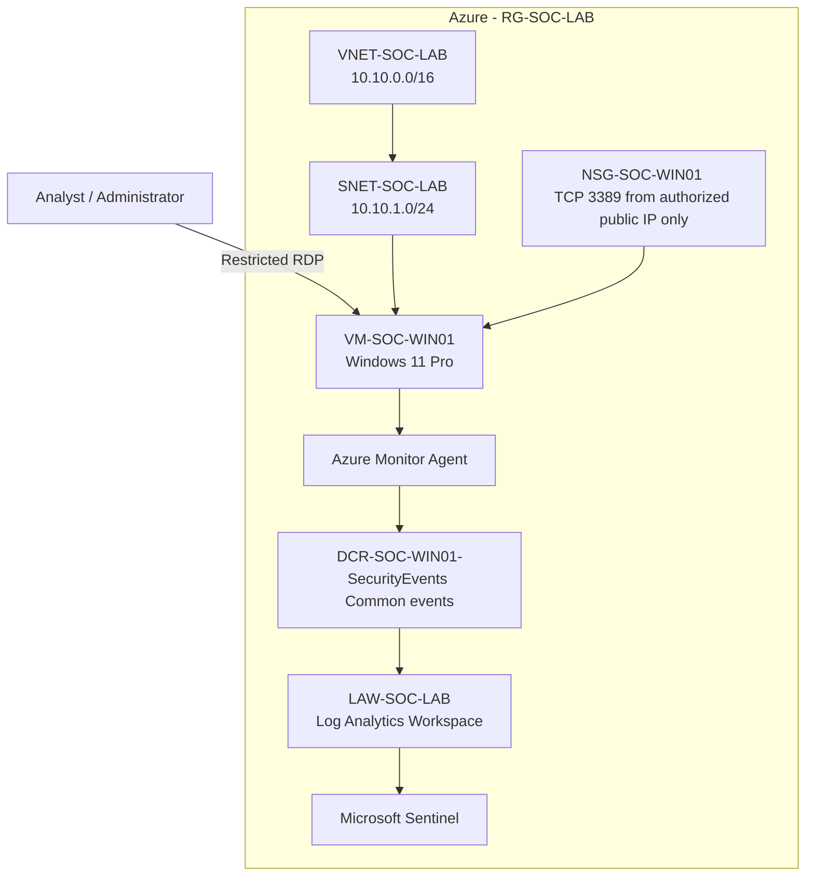

# SOC Cloud Security Lab

A hands-on Security Operations Center (SOC) and cloud-security learning lab built on Microsoft Azure.

The lab is designed as a progressive environment rather than a one-time deployment. Each phase introduces a security capability, validates it with controlled activity, and documents the result.

## Objectives

- Build practical SOC fundamentals using Microsoft Sentinel.
- Learn Windows security telemetry and event investigation.
- Understand Azure Monitor Agent (AMA), Data Collection Rules (DCRs), Log Analytics, KQL, detections, incidents, and response workflows.
- Progress from endpoint monitoring into cloud-security concepts.
- Practice security architecture, network segmentation, identity, logging, detection engineering, investigation, threat hunting, and incident response.
- Maintain the project as a documented portfolio project with reproducible configuration and lessons learned.
- Keep Azure usage cost-conscious because the lab is running on an Azure for Students subscription.

## Current Lab Status

**Milestone 01 — Azure SOC Foundation & Windows Telemetry Pipeline: Complete**

At the end of the first phase, the lab can:

1. Generate Windows Security events on `VM-SOC-WIN01`.
2. Collect selected Windows Security events using Azure Monitor Agent.
3. Apply a Data Collection Rule using the Common event set.
4. Ingest the events into the `SecurityEvent` table in `LAW-SOC-LAB`.
5. Query the telemetry using KQL in Microsoft Sentinel.

## Current Architecture



## Documentation

### Foundation

- [01 — Lab Foundation](docs/01-lab-foundation.md)
- [02 — Windows Endpoint & Telemetry Pipeline](docs/02-windows-endpoint-telemetry.md)

### Architecture & Diagrams

- [Architecture Diagram](docs/diagrams/architecture.md)
- [Windows Telemetry Ingestion Flow](docs/diagrams/telemetry-ingestion.md)
- [Network & Access Flow](docs/diagrams/network-security.md)


## Lab Roadmap

The roadmap will evolve as the lab grows.

```text
Azure Foundation
      ↓
Windows Telemetry
      ↓
KQL Fundamentals
      ↓
Detection Engineering
      ↓
Alert → Incident → Investigation
      ↓
Threat Hunting
      ↓
PowerShell / Process / Persistence Scenarios
      ↓
Linux Telemetry
      ↓
Attacker Simulation
      ↓
Network Security / NSG / Firewall
      ↓
Identity & Entra ID Security
      ↓
Azure Activity / Control-Plane Monitoring
      ↓
Cloud Security Posture & Defender Capabilities
      ↓
Advanced SOC Scenarios
```

## Design Principles

### 1. Learn before automating

Each component is introduced manually first so its purpose and data flow are understood before automation is added.

### 2. Security by design

Management access is restricted where practical, unnecessary inbound ports are avoided, and lab resources are isolated in a dedicated resource group and virtual network.

### 3. Cost awareness

The lab prioritizes low-cost VM sizes, Standard SSD storage, auto-shutdown, selective telemetry collection, and removal of unused resources.

### 4. Evidence-driven learning

Every major scenario should answer:

- What activity was generated?
- What telemetry was produced?
- Where did the telemetry go?
- How was it queried?
- What detection identified it?
- How would an analyst investigate it?
- What response could be taken?

## Change Log

| Date | Milestone | Status |
|---|---|---|
| 2026-08-12 | Azure foundation created | Complete |
| 2026-08-12 | Windows endpoint deployed | Complete |
| 2026-08-12 | Windows Security Events via AMA configured | Complete |
| 2026-08-12 | Telemetry data validated in `SecurityEvent` | Complete |

## Disclaimer

This is a controlled learning environment. Security testing and attack simulations will be performed only against lab resources intentionally created for this project.
