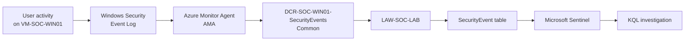

# 02 — Windows Endpoint & Telemetry Pipeline

## 1. Objective

The objective of this phase was to move from a standalone Windows endpoint to a monitored SOC endpoint.

The target flow was:

```text
Windows Security Log
        ↓
Azure Monitor Agent (AMA)
        ↓
Data Collection Rule (DCR)
        ↓
Log Analytics Workspace
        ↓
SecurityEvent table
        ↓
Microsoft Sentinel
        ↓
KQL investigation
```

## 2. Why Start With Windows Security Events?

Windows generates security-relevant telemetry whenever users authenticate, processes execute, privileges are used, accounts change, and security settings are modified.

A SOC cannot investigate activity that it cannot collect.

The first learning exercise therefore focused on understanding the raw Windows Security log before sending it to Sentinel.

## 3. Raw Telemetry Validation

Before configuring Sentinel ingestion, activity was generated directly on `VM-SOC-WIN01`.

The Windows Event Viewer was used to inspect:

```text
Event Viewer
└── Windows Logs
    └── Security
```

A successful logon event with Event ID `4624` was observed.

This established the baseline:

```text
User activity
    ↓
Windows
    ↓
Security Event Log
    ↓
Event ID 4624
```

## 4. Windows Security Events Solution

The **Windows Security Events** solution was installed through the Sentinel Content Hub.

The modern connector used for this lab is:

> Windows Security Events via AMA

The legacy Security Events connector was intentionally not used.

## 5. Azure Monitor Agent

Azure Monitor Agent (AMA) is the collection agent used to obtain Windows telemetry from the endpoint.

AMA does not decide by itself which events should be sent to the workspace. The Data Collection Rule defines the collection configuration.

## 6. Data Collection Rule

The following DCR was created:

```text
DCR-SOC-WIN01-SecurityEvents
```

It was associated with:

```text
VM-SOC-WIN01
```

The selected event set was:

```text
Common
```

### Why Common instead of All?

Collecting all available security events is not automatically better for a learning SOC.

A broader event stream can increase:

- Noise.
- Storage.
- Query volume.
- Ingestion cost.

The Common event set provides a useful starting point for security monitoring while leaving room for targeted custom collection later.

The lab will eventually use custom event selection for specific scenarios so that event collection itself becomes part of the learning process.

## 7. SecurityEvent Table

The connector created/used the following table in `LAW-SOC-LAB`:

```text
SecurityEvent
```

At the time of configuration, the table showed:

- Tier: Analytics
- Table type: Sentinel
- Analytics retention: 30 days
- Total retention: 30 days

The retention configuration should be reviewed periodically as the lab grows because retention and ingestion are important cost considerations.

## 8. End-to-End Validation

After the DCR was created, a fresh logon was generated by locking and unlocking the Windows VM.

The event was then queried in Sentinel using KQL:

```kusto
SecurityEvent
| where EventID == 4624
| sort by TimeGenerated desc
| take 10
```

The query returned events from:

```text
Computer:        VM-SOC-WIN01
Channel:         Security
EventID:         4624
EventSourceName: Microsoft-Windows-Security-Auditing
```

A result also showed the user account:

```text
VM-SOC-WIN01\ikrama
```

This validated the complete telemetry path.

## 9. Validated Architecture



## 10. What Was Proven

This phase proved that:

1. Windows generated security telemetry.
2. The telemetry was visible locally.
3. AMA could collect the telemetry.
4. The DCR controlled the collection configuration.
5. Events reached the Log Analytics workspace.
6. Events were available in the `SecurityEvent` table.
7. Sentinel could query the centralized telemetry using KQL.

This is the first complete SOC telemetry pipeline in the lab.

## 11. Important SOC Concept

At this stage there is **no real detection or incident response yet**.

We have completed:

> **Telemetry → Collection → Centralization → Query**

The next phase will introduce:

> **Detection → Alert → Investigation → Incident → Response**

## Screenshots

Recommended evidence:

- `screenshots/windows/security-event-viewer.png`
- `screenshots/sentinel/windows-security-events-ama.png`
- `screenshots/sentinel/dcr-common.png`
- `screenshots/sentinel/securityevent-4624.png`

The final KQL screenshot is particularly important because it demonstrates that the telemetry was not merely configured—it was actually received and queried.

## Lessons Learned

- Raw endpoint telemetry should be understood before relying on a SIEM.
- AMA is the collection agent; the DCR controls what is collected.
- A SIEM is useful only when relevant telemetry reaches it reliably.
- Event collection should balance visibility, noise, and cost.
- A successful ingestion test should use a controlled activity and a query that proves the expected event arrived.
