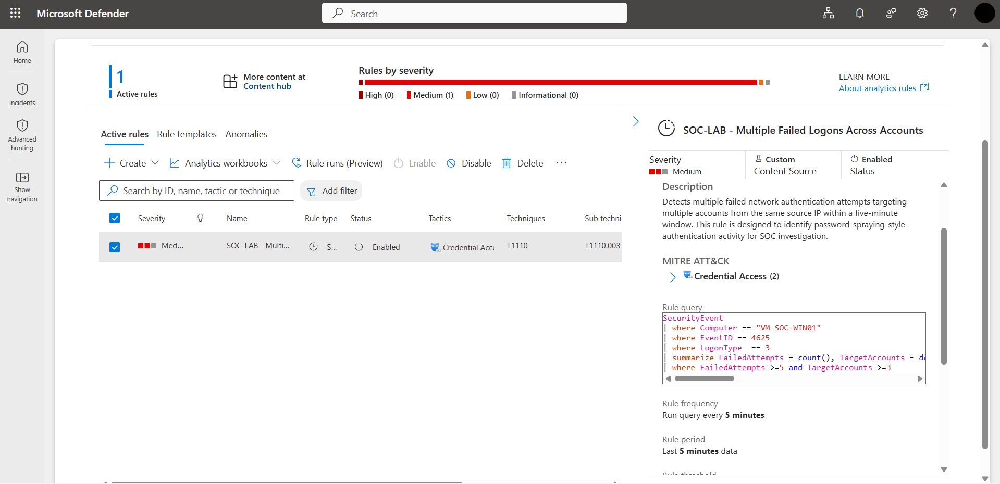
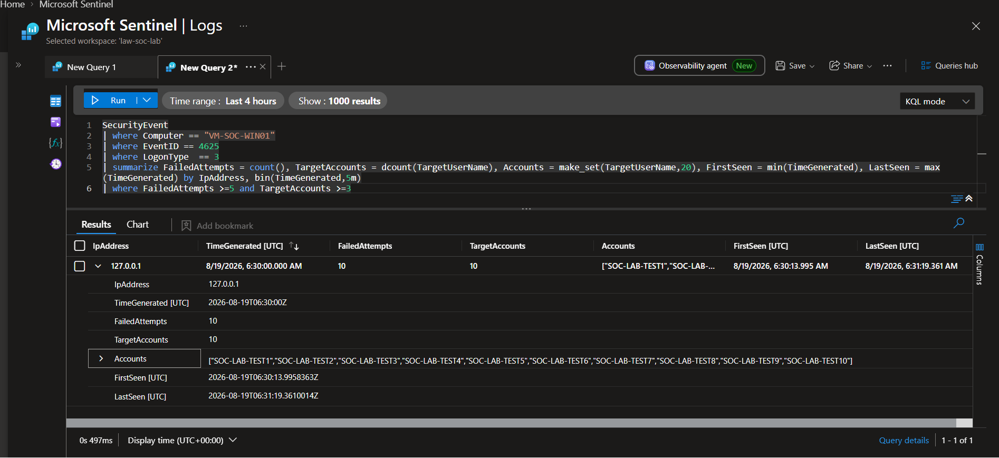

# 03 - Detection Engineering & Incident Investigation

## 1. Objective

This phase moves the lab from passive telemetry collection into the first complete SOC detection and investigation workflow.

The objective was to:

1. Identify a suspicious authentication pattern from Windows Security telemetry.
2. Build a custom Microsoft Sentinel analytics rule.
3. Generate controlled test activity.
4. Validate that the rule produces an alert.
5. Investigate the resulting incident.
6. Determine whether the activity is controlled lab testing or requires escalation.
7. Close the incident after investigation.

The workflow validated was:

```text
Windows Security Event
        ↓
KQL detection logic
        ↓
Analytics rule
        ↓
Alert
        ↓
Incident
        ↓
Investigation
        ↓
Classification
        ↓
Closure
```

## 2. Detection Scenario

The selected scenario is repeated failed network authentication attempts against multiple accounts.

Windows Event ID:

```text
4625 - An account failed to log on
```

The detection focuses on:

- `EventID == 4625`
- `LogonType == 3` (Network)
- Multiple failed attempts
- Multiple targeted accounts
- Same source IP
- Same five-minute time window

This is useful as a basic password-spraying-style detection pattern.

> The rule is intended for controlled SOC learning. The presence of the pattern alone does not prove malicious activity; analyst investigation and context are required.

## 3. Detection Logic

The following KQL was used:

```kusto
SecurityEvent
| where Computer == "VM-SOC-WIN01"
| where EventID == 4625
| where LogonType == 3
| summarize FailedAttempts = count(),
            TargetAccounts = dcount(TargetUserName),
            Accounts = make_set(TargetUserName,20),
            FirstSeen = min(TimeGenerated),
            LastSeen = max(TimeGenerated)
    by IpAddress, bin(TimeGenerated,5m)
| where FailedAttempts >=5 and TargetAccounts >=3
```

### Logic explained

| Query component | Purpose |
|---|---|
| `Computer == "VM-SOC-WIN01"` | Restricts the detection to the lab endpoint |
| `EventID == 4625` | Selects failed logon events |
| `LogonType == 3` | Focuses on network authentication |
| `count()` | Counts failed attempts |
| `dcount(TargetUserName)` | Counts distinct targeted accounts |
| `make_set()` | Preserves the targeted account names for investigation |
| `min(TimeGenerated)` | Identifies the first observed event |
| `max(TimeGenerated)` | Identifies the last observed event |
| `bin(...,5m)` | Groups activity into five-minute windows |
| `FailedAttempts >= 5` | Requires repeated failures |
| `TargetAccounts >= 3` | Requires multiple targeted accounts |

## 4. Analytics Rule Configuration

The custom rule was created as:

**SOC-LAB - Multiple Failed Logons Across Accounts**

### Rule configuration

| Setting | Value |
|---|---|
| Name | `SOC-LAB - Multiple Failed Logons Across Accounts` |
| Severity | Medium |
| Status | Enabled |
| MITRE tactic | Credential Access |
| MITRE technique | T1110 - Brute Force |
| MITRE sub-technique | T1110.003 - Password Spraying |
| Query frequency | Every 5 minutes |
| Query period | Last 5 minutes |
| Trigger threshold | More than 0 results |
| Event grouping | Alert for each event |
| Suppression | Not configured |
| Entity mapping | Not configured |
| Custom details | Not configured |
| Alert details | Not configured |
| Incident creation | Enabled |
| Alert grouping | Disabled |
| Automated response | Not configured |

The rule was deliberately kept simple for the first detection-engineering exercise. Entity mapping, alert enrichment, grouping, suppression, and automation will be introduced as the lab matures.

## 5. Controlled Test Activity

After enabling the rule, controlled failed-logon activity was generated against the Windows endpoint.

The test generated multiple failed Event ID `4625` records targeting lab-created test accounts.

The resulting aggregated query showed:

```text
Source IP:       127.0.0.1
Failed Attempts: 10
Target Accounts: 10
Time Window:     approximately 1 minute
```

The targeted accounts followed the lab naming pattern:

```text
SOC-LAB-TEST1
SOC-LAB-TEST2
SOC-LAB-TEST3
...
SOC-LAB-TEST10
```

## 6. Alert and Incident Validation

The analytics rule successfully generated an alert from the controlled activity.

The alert was then used to create and investigate a Sentinel incident.

The investigation workflow included:

1. Reviewing the alert.
2. Opening the incident.
3. Reviewing the available event fields.
4. Checking the source IP.
5. Checking the affected hostname.
6. Reviewing targeted accounts.
7. Reviewing authentication details such as logon type.
8. Assessing whether the activity matched the expected lab test.
9. Closing the incident after the investigation.

## 7. Investigation Reasoning

The activity was classified as controlled testing based on multiple pieces of context rather than a single field.

### Source IP

The observed source IP was:

```text
127.0.0.1
```

This is the IPv4 loopback address. It indicates that the generated authentication activity originated from the local host context rather than an external public source.

This was a strong indicator that the activity belonged to the controlled lab test.

> A loopback address by itself should not be treated as proof that activity is harmless. In a real investigation, the analyst would continue validating the process, account, host, timeline, and surrounding telemetry.

### Target accounts

The affected accounts followed the deliberate test naming convention:

```text
SOC-LAB-TEST1
SOC-LAB-TEST2
...
SOC-LAB-TEST10
```

This strongly matched the scenario that was intentionally generated for the lab.

Real-world activity would require validating whether the targeted accounts correspond to legitimate users, service accounts, privileged identities, or nonexistent accounts.

### Host

The activity was associated with:

```text
VM-SOC-WIN01
```

This matched the known SOC lab endpoint.

### Authentication context

The events used:

```text
LogonType: 3 - Network
EventID:    4625
```
—
This matched the exact condition the analytics rule was designed to detect.

## 8. Public IP Investigation - What Would Happen in a Real Case?

If the same detection originated from a public IP address, the investigation would be expanded.

The analyst could:

1. Validate the IP reputation and ownership.
2. Check threat-intelligence sources.
3. Review the IP's historical activity.
4. Determine whether the source belongs to a known corporate/VPN/cloud provider.
5. Correlate the source with other authentication events.
6. Check whether other endpoints or accounts were targeted.

A reputation service such as VirusTotal can be used as one enrichment source, but it should not be treated as the sole basis for declaring an IP malicious or benign.

## 9. Incident Closure

After reviewing the source IP, hostname, targeted accounts, event type, and test context, the incident was determined to be controlled lab activity.

The incident was closed successfully.

This completed the first end-to-end detection lifecycle in the lab:

```text
Telemetry
   ↓
Detection
   ↓
Alert
   ↓
Incident
   ↓
Investigation
   ↓
Classification
   ↓
Closure
```

## 10. What Was Proven

This phase proved that the lab can:

- Generate security-relevant authentication activity.
- Query Windows telemetry using KQL.
- Convert a hunting query into a scheduled analytics rule.
- Generate a Sentinel alert.
- Create an incident from the alert.
- Investigate the incident using available context.
- Differentiate controlled lab activity from an event that would require further investigation.
- Close the incident after analysis.

## Screenshots

### Analytics rule



### Detection query and test result



## Lessons Learned

- Detection engineering is more than writing a KQL query; the output must support investigation.
- Thresholds should be chosen to reduce noise while retaining meaningful activity.
- An alert is not automatically an incident of compromise.
- Source IP, hostname, targeted accounts, event type, and timeline should be considered together.
- Controlled testing should use clearly identifiable test accounts and predictable infrastructure so the analyst can distinguish test activity from real activity.
