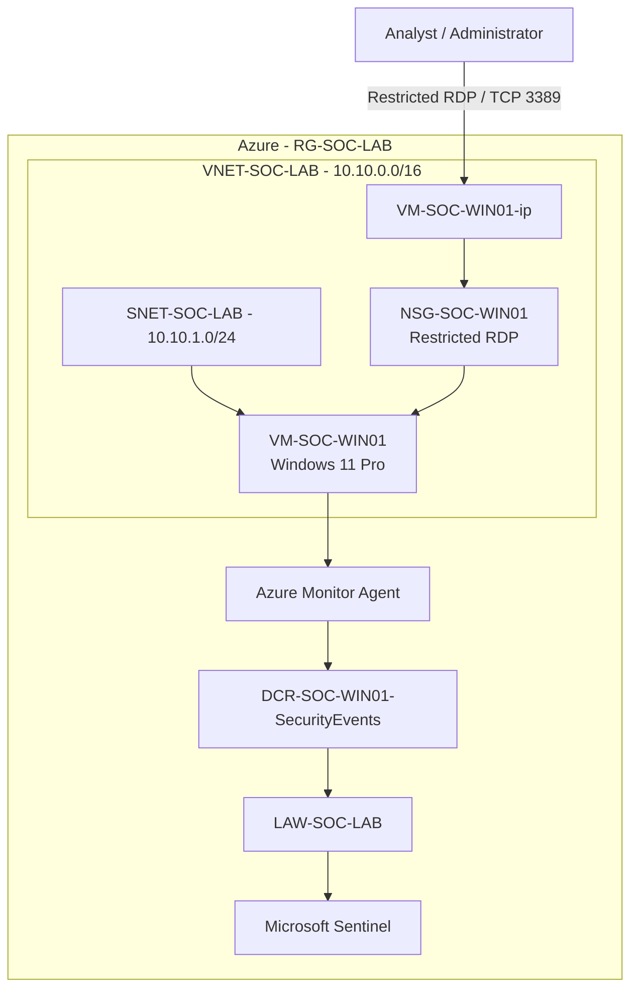

# Architecture v1 — Azure SOC Foundation

> **Milestone:** 01 — Lab Foundation  
> **Status:** Historical / Retained for version history

This was the initial architecture of the SOC Cloud Security Lab. The first version established the Azure infrastructure, Windows endpoint, administrative access controls, and Windows security telemetry pipeline into Microsoft Sentinel.

## Architecture



## Telemetry Flow

```text
VM-SOC-WIN01
      |
      v
Windows Security Event Log
      |
      v
Azure Monitor Agent
      |
      v
DCR-SOC-WIN01-SecurityEvents
      |
      v
LAW-SOC-LAB
      |
      v
Microsoft Sentinel
```

## Components

| Component | Name | Purpose |
|---|---|---|
| Resource Group | `RG-SOC-LAB` | Logical container for SOC lab resources |
| Virtual Network | `VNET-SOC-LAB` | Network boundary |
| Subnet | `SNET-SOC-LAB` | Endpoint network segment |
| Windows VM | `VM-SOC-WIN01` | Initial monitored endpoint |
| NSG | `NSG-SOC-WIN01` | Restricts inbound management access |
| Public IP | `VM-SOC-WIN01-ip` | Initial RDP management path |
| Azure Monitor Agent | AMA | Endpoint telemetry collection |
| Data Collection Rule | `DCR-SOC-WIN01-SecurityEvents` | Defines Windows Security event collection |
| Log Analytics | `LAW-SOC-LAB` | Central telemetry storage |
| Microsoft Sentinel | Sentinel | SIEM and investigation platform |

## Historical Context

This architecture is intentionally preserved as **v1**. Later versions extend the same foundation with detection engineering and additional security telemetry.
