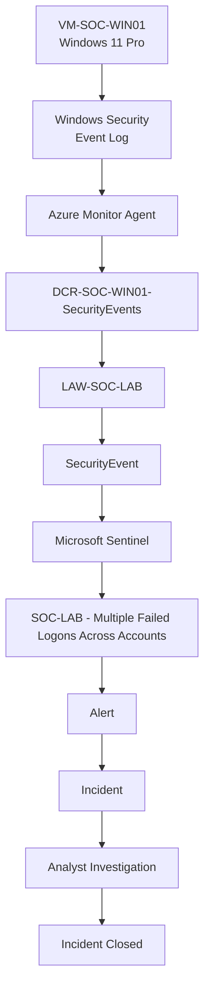

# Architecture v2 — Detection Engineering

> **Milestone:** 02 — Detection Engineering & Incident Investigation  
> **Status:** Completed

Version 2 builds detection and incident investigation capabilities on top of the original Windows telemetry pipeline.

## Architecture



## Detection Scenario

The detection identifies multiple failed network authentication attempts targeting multiple accounts from the same source IP within a five-minute window.

### Detection Conditions

- Windows Event ID: `4625`
- Logon Type: `3 - Network`
- Failed attempts: `>= 5`
- Targeted accounts: `>= 3`
- Aggregation window: `5 minutes`

### Detection Flow

```text
Event ID 4625 + Logon Type 3
              |
              v
       Group by source IP
              |
              v
        5-minute window
              |
              v
  5+ failures AND 3+ accounts
              |
              v
        Analytics Rule
              |
              v
             Alert
              |
              v
           Incident
              |
              v
          Investigation
              |
              v
            Closure
```

## Controlled Validation

A controlled test generated failed authentication attempts against intentionally created test accounts:

```text
SOC-LAB-TEST1
SOC-LAB-TEST2
SOC-LAB-TEST3
SOC-LAB-TEST4
SOC-LAB-TEST5
SOC-LAB-TEST6
SOC-LAB-TEST7
SOC-LAB-TEST8
SOC-LAB-TEST9
SOC-LAB-TEST10
```

The observed source address was:

```text
127.0.0.1
```

The activity successfully generated Event ID `4625` records and triggered the custom analytics rule.

## Investigation Approach

The alert and incident were reviewed using the available investigation fields, including:

- Source IP address
- Hostname
- Targeted accounts
- Logon type
- Authentication details
- Alert context
- Incident context

The activity was classified as controlled lab testing because the source was the loopback address `127.0.0.1` and the targeted accounts followed the intentional `SOC-LAB-TEST*` naming convention.

For a real unfamiliar public source IP, additional investigation would be required, including threat-intelligence and reputation checks.

## Result

The complete detection workflow was validated:

```text
Telemetry
   |
   v
Detection
   |
   v
Alert
   |
   v
Incident
   |
   v
Investigation
   |
   v
Classification
   |
   v
Closure
```
