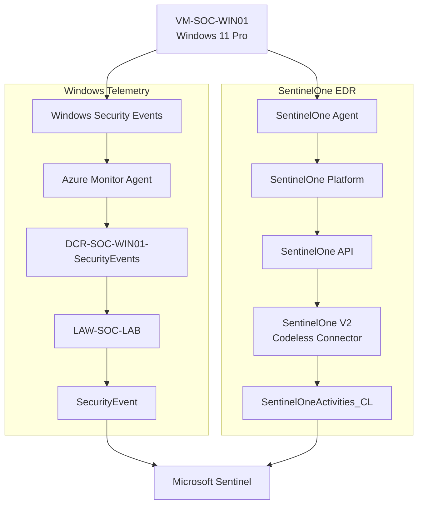

# Architecture v3 — Multi-Source SOC

> **Milestone:** 03 — SentinelOne EDR Integration  
> **Date:** 19 August 2026  
> **Status:** Completed

Version 3 introduces SentinelOne EDR as an additional endpoint telemetry source while retaining the original Windows Security Event pipeline.

## Architecture



## Windows Telemetry Path

```text
VM-SOC-WIN01
      |
      v
Windows Security Events
      |
      v
Azure Monitor Agent
      |
      v
DCR-SOC-WIN01-SecurityEvents
      |
      v
LAW-SOC-LAB
      |
      v
SecurityEvent
      |
      v
Microsoft Sentinel
```

## SentinelOne Telemetry Path

```text
VM-SOC-WIN01
      |
      v
SentinelOne Agent
      |
      v
SentinelOne Platform
      |
      v
SentinelOne API
      |
      v
SentinelOne V2 Codeless Connector
      |
      v
SentinelOneActivities_CL
      |
      v
Microsoft Sentinel
```

## SentinelOne Deployment

A dedicated SentinelOne group was used for the lab:

```text
SOC-Lab-Ikrama
```

The first endpoint participating in the integration is:

```text
VM-SOC-WIN01
```

The endpoint was validated as healthy and connected in the SentinelOne console.

## SentinelOne to Microsoft Sentinel Integration

The **SentinelOne V2 (via Codeless Connector Framework)** solution was installed in Microsoft Sentinel.

A SentinelOne API connection was configured using the SentinelOne Management URL and a service-user API token.

The connector is designed to ingest SentinelOne data into Microsoft Sentinel, including activities and supported endpoint/security data.

## Data Ingestion Validation

Recent SentinelOne activity was validated with:

```kusto
SentinelOneActivities_CL
| where TimeGenerated > ago(1h)
| order by TimeGenerated desc
```

The query returned recent records from the custom SentinelOne table.

The table schema was also inspected with:

```kusto
SentinelOneActivities_CL
| getschema
```

The schema query returned the available fields, confirming that the SentinelOne custom table was present and queryable.

## Current State

### Completed

- SentinelOne agent deployed to `VM-SOC-WIN01`
- SentinelOne endpoint health and connectivity validated
- SOC-specific SentinelOne group established
- SentinelOne V2 Codeless Connector installed
- SentinelOne API connection configured
- SentinelOne activity data successfully ingested
- `SentinelOneActivities_CL` validated
- SentinelOne table schema inspected

### Not Yet Implemented

- SentinelOne-specific analytics rules
- SentinelOne threat simulation
- Windows + SentinelOne correlation
- Advanced SentinelOne threat hunting
- Automated response

These capabilities will be introduced in later architecture versions.

## Architectural Change

The SOC lab has evolved from a single Windows telemetry source into a multi-source SOC:

```text
Windows Security Events ─────┐
                             |
                             v
                      Microsoft Sentinel
                             ^
                             |
SentinelOne EDR ─────────────┘
```

This establishes the foundation for future correlation between operating-system telemetry and EDR telemetry.
