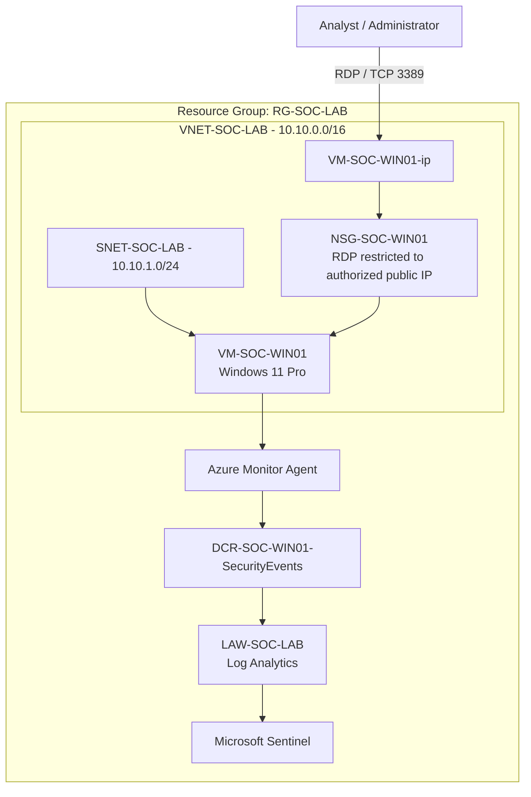

# Architecture Diagram

## Day 1 - Azure SOC Foundation

## Architectural intent

The lab is intentionally separated into:

1. **Network layer** - VNet, subnet, NSG and public management path.
2. **Endpoint layer** - Windows endpoint producing security telemetry.
3. **Collection layer** - AMA and DCR.
4. **Data layer** - Log Analytics and `SecurityEvent`.
5. **SOC layer** - Microsoft Sentinel.

This separation makes it easier to understand where a failure occurs.

For example:

- No Windows event → endpoint problem.
- Event exists locally but not centrally → collection/agent/DCR problem.
- Event reaches Log Analytics but query fails → KQL/table/query problem.
- Event is visible but no alert → detection engineering problem.
