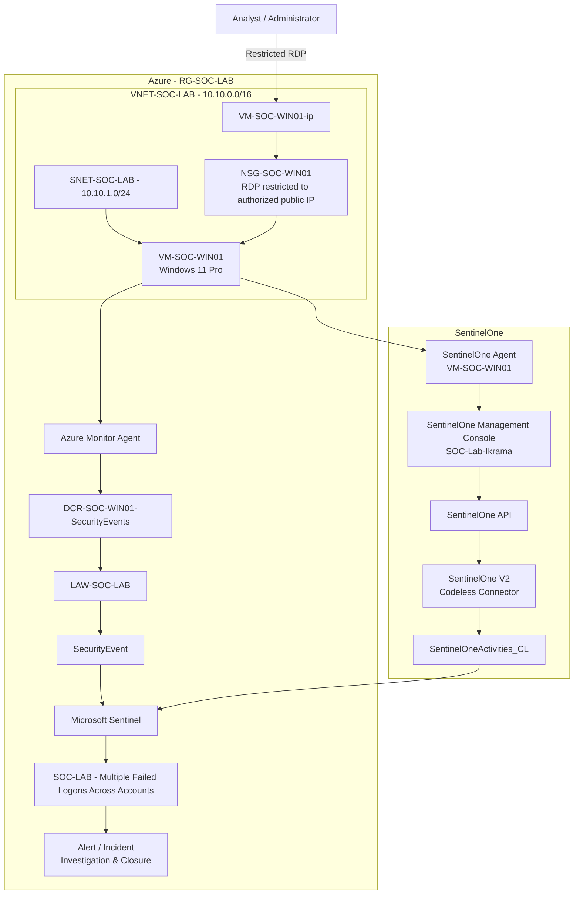

# SOC Lab Architecture

## Architecture Evolution

The SOC Cloud Security Lab is intentionally documented as an evolving architecture rather than only as a final-state diagram.

| Version | Milestone | Focus | Status |
|---|---|---|---|
| V1 | Azure SOC Foundation | Azure network, Windows endpoint and initial telemetry path | Historical |
| V2 | Detection Engineering | Windows telemetry, KQL detection, alert and incident workflow | Historical |
| V3 | SentinelOne EDR Integration | Multi-source telemetry with SentinelOne EDR + Microsoft Sentinel | Current |

### Version history

- [Architecture V1 — Azure SOC Foundation](architecture-v1-foundation.md)
- [Architecture V2 — Detection Engineering](architecture-v2-detection.md)
- [Architecture V3 — Multi-Source SOC](architecture-v3-multi-source.md)

The historical versions are intentionally retained to show how the lab evolved.

---

## Current Architecture — V3

## Supporting Flows

- [Windows Security Telemetry Ingestion](telemetry-ingestion.md)
- [SentinelOne EDR Integration](sentinelone-integration.md)
- [Detection & Incident Response](detection-and-response.md)
- [Network & Access Flow](network-security.md)
