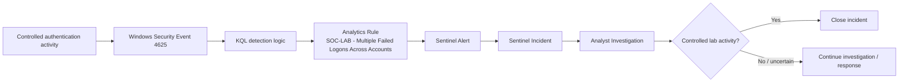

# Detection & Incident Response Flow

## First detection lifecycle



## Detection condition

The rule looks for:

```text
Event ID 4625
        +
Logon Type 3
        +
5 or more failures
        +
3 or more targeted accounts
        +
same source IP
        +
five-minute window
```

## Investigation decision points

The analyst reviewed:

- Source IP.
- Hostname.
- Targeted accounts.
- Logon type.
- Event details.
- Timeline.
- Whether the activity matched the known lab test.

The test used:

```text
127.0.0.1
SOC-LAB-TEST1 ... SOC-LAB-TEST10
VM-SOC-WIN01
```

These indicators matched the controlled scenario and supported incident closure.

## Important SOC principle

Detection should identify activity that deserves investigation. It should not automatically declare an intrusion.

The analyst must combine detection output with context before deciding whether to close, escalate, contain, or investigate further.
