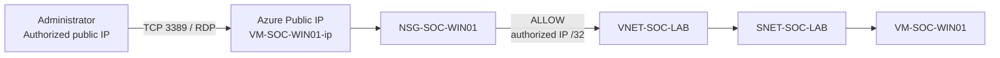

# Network & Access Flow

## Initial management path



## NSG decision

The custom rule is:

```text
Priority:          100
Source:            Authorized public IP /32
Source port:       *
Destination:       Any
Service:           RDP
Destination port:  3389
Protocol:          TCP
Action:            Allow
```

Traffic that does not match an applicable allow rule is denied by the NSG's default inbound deny behavior.

## Security objective

The purpose of this configuration is to avoid exposing RDP to every Internet source.

The public IP is retained for the initial learning workflow. More mature access patterns can be introduced later as the cloud-security portion of the lab expands.
