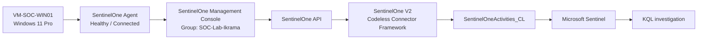

# SentinelOne EDR Integration Flow

## End-to-end SentinelOne → Microsoft Sentinel flow



## Integration components

| Component | Role |
|---|---|
| SentinelOne Agent | Generates endpoint security telemetry |
| `SOC-Lab-Ikrama` | Dedicated SOC lab endpoint group |
| SentinelOne Management Console | Central EDR management |
| SentinelOne API | Provides data to the Sentinel connector |
| SentinelOne V2 Codeless Connector | Ingests S1 telemetry into Sentinel |
| `SentinelOneActivities_CL` | Sentinel table containing S1 activity telemetry |
| Microsoft Sentinel | Central SIEM, hunting and detection platform |

## Data types exposed by the connector

The configured connector showed these data types:

- Activities
- Agents (new)
- Agents (updated)
- Alerts (V2)
- Groups
- Threats (new)

## Validation query

```kusto
SentinelOneActivities_CL
| where TimeGenerated > ago(1h)
| order by TimeGenerated desc
```

The validation returned three recent activity records.

## Schema discovery

```kusto
SentinelOneActivities_CL
| getschema
```

The table exposed 26 columns. The initial schema review showed fields including:

```text
TimeGenerated
AgentUpdatedVersion
UserId
ThreatId
PrimaryDescription
SecondaryDescription
Id
```

Schema exploration will continue when S1-specific detections are introduced.
