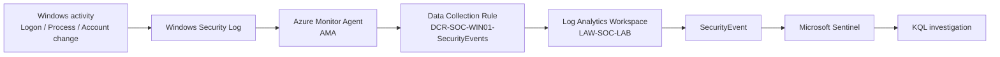

# Windows Security Telemetry Ingestion Flow

## End-to-end Windows data flow



## Current configuration

| Component | Current value |
|---|---|
| Endpoint | `VM-SOC-WIN01` |
| Agent | Azure Monitor Agent |
| DCR | `DCR-SOC-WIN01-SecurityEvents` |
| Event set | Common |
| Workspace | `LAW-SOC-LAB` |
| Table | `SecurityEvent` |
| Retention at configuration | 30 days |
| SIEM | Microsoft Sentinel |

## Validation examples

### Successful logon

A controlled logon generated Event ID `4624`.

```kusto
SecurityEvent
| where EventID == 4624
| sort by TimeGenerated desc
| take 10
```

### Failed network logon

The detection phase used Event ID `4625` with Logon Type `3`.

```kusto
SecurityEvent
| where Computer == "VM-SOC-WIN01"
| where EventID == 4625
| where LogonType == 3
```

### Multi-account aggregation

```kusto
SecurityEvent
| where Computer == "VM-SOC-WIN01"
| where EventID == 4625
| where LogonType == 3
| summarize FailedAttempts = count(),
            TargetAccounts = dcount(TargetUserName),
            Accounts = make_set(TargetUserName,20),
            FirstSeen = min(TimeGenerated),
            LastSeen = max(TimeGenerated)
    by IpAddress, bin(TimeGenerated,5m)
| where FailedAttempts >=5 and TargetAccounts >=3
```

These queries demonstrate the progression from raw telemetry to detection-oriented aggregation.
