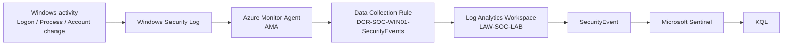

# Windows Security Telemetry Ingestion Flow

## End-to-end data flow



## Current configuration

| Component | Current value |
|---|---|
| Endpoint | `VM-SOC-WIN01` |
| Agent | Azure Monitor Agent |
| DCR | `DCR-SOC-WIN01-SecurityEvents` |
| Event set | Common |
| Workspace | `LAW-SOC-LAB` |
| Table | `SecurityEvent` |
| Retention at configuration | 30 days |
| SIEM | Microsoft Sentinel |

## Validation example

A controlled logon generated Event ID `4624`.

The same event was then found centrally with:

```kusto
SecurityEvent
| where EventID == 4624
| sort by TimeGenerated desc
| take 10
```

This confirms the telemetry path is operational.
